# Note importante sur l'équipe et la répartition du travail 

## Équipe
<ul>
  <li>Rémi Lalonde</li>
  <li>Martin Medina</li>
  <li>Guillaume Collin</li>
  <li>Larissa Avononmadegbe</li>
</ul>

**IMPORTANT:** Même si théoriquement nous sommes 4 personnes dans l'équipe (voir la liste ci-dessus), Larissa Avononmadegbe nous a mentionné depuis le début qu'elle allait abandonner le cours, donc qu'elle n'allait pas contribuer au travail. De même, Guillaume Collin a été rajouté à notre équipe la première semaine d'octobre, moment où le travail était déjà presque terminé (il manquait juste faire le dernier graphique des visualisations avancées et les discussions). Donc, vu qu'il vennait de rejoindre le groupe et qu'il n'était pas familiarisé avec notre code, il n'a pas contribué au travail (il contribuera à partir du Milestone 2). 

Alors, les seules personnes qui ont réalisé et contribué au travail sont <b>Rémi Lalonde</b> et <b>Martin Medina</b>. La répartition du travail entre ces deux personnes est décrite dans le tableau ci-dessous.

## Répartition du travail 

<table border="1" style="border-collapse: collapse; margin: auto; text-align: left; width: 90%;">
  <thead style="background-color: #f2f2f2;">
    <tr>
      <th>Tâche</th>
      <th>Fait par...</th>
    </tr>
  </thead>
  <tbody>
    <tr>
      <td><b>1. Acquisition de données</b> (25%)</td>
      <td>Rémi Lalonde</td>
    </tr>
    <tr>
      <td><b>2. Outil de débogage interactif</b> (10%)</td>
      <td>Rémi Lalonde</td>
    </tr>
    <tr>
      <td><b>3. Nettoyer les données</b> (10%)</td>
      <td>Rémi Lalonde</td>
    </tr>
    <tr>
      <td><b>4. Visualisations simples</b> (25%)</td>
      <td>Martin Medina</td>
    </tr>
    <tr>
      <td><b>5. Visualisations avancées</b> (30%)</td>
      <td>Martin Medina</td>
    </tr>
  </tbody>
</table>

# 1. Acquisition de données
## Question 1

Pour télécharger les données, une classe nommée Data a été créée. Pour effectuer le téléchargement, il suffit simplement d'instancier cette classe puis d'appeler la fonction *load_data_local(season: list[str], merge_one_file: bool)* en lui passant une liste de saisons en argument, ce qui permet d'indiquer les saisons à télécharger. Ensuite, il suffit d'appeler la fonction *get_data(file_path: str)* pour avoir accès aux données en lui passant le chemin du fichier de la partie. Ceci est montré dans l'exemple de code suivant.

```python
    d = Data()
    d.load_data_local(['2016-2017', '2017-2018', '2018-2019', 
                       '2019-2020', '2020-2021', '2021-2022', 
                       '2022-2023', '2023-2024'], merge_one_file=True)
    data = d.get_data(os.path.join(d.data_path, '2017-2018', '2017020005.json'))
```

Plus en détail, le téléchargement se déroule en trois grandes étapes :

1. **Récupération de la liste des matchs** <br>
    Cette étape consiste à aller chercher l'ensemble des parties disponibles via l'API NHL-reference et les sauvegarder dans un fichier JSON nommé *all_games.json*. Si ce fichier existe déjà, il n'est pas nécessaire de le retélécharger, il est directement chargé depuis le disque local.

2. **Téléchargement des matchs d’une saison**<br>
    Une fois toutes les parties chargées, pour chaque saison passée en argument à la fonction, une vérification est effectuée pour déterminer quelles parties sont manquantes dans le sous-dossier correspondant à la saison. Une fois cette vérification terminée, le téléchargement des parties manquantes est effectué.

3. **Sauvegarde et Organisation**<br>
    Finalement, tous les fichiers sont organsés dans un dossier par saison. Ainsi, chaque partie de chaque saison est représentée par un fichier JSON nommé *{ID de la partie}.json*. Il est également possible d'activer l'option *merge_one_file=True* dans les arguments de la fonction *load_data_local*, ce qui permet de fusionner l'ensemble des parties dans un fichier JSON nommé *play_by_play.json*. La capture d'écran suivante montre une petite partie de la structure des fichiers.

<figure style="text-align: center;">
  
  <figcaption>
    <em>Figure 1 :</em> Structure des fichiers de données.
  </figcaption>
</figure>

# 2. Outil de débogage interactif
## Question 1

L'outil interactif nous permet de parcourir l'ensemble des données et de visualiser les évènements survenus lors des parties. On peut sélectionner la saison, le type de partie, la partie désirée ainsi que l'évènement. <br>

Certaines informations générales sont affichées, comme les équipes qui s'affrontent, le lieu, la date, l'heure, le résultat final et  nombre de tirs cadrés effectués par chaque équipe. <br>

Il y a également des informations suplémentaires par rapport aux évènements, notamment le type d'évènement, et le ou les joueurs impliqués. Selon le type d'évènement, il peut y avoir différents détails affichés: par exemple, dans l'exemple ci-dissous, l'évènement est un tir, donc le type de tire est affiché. <br>

Enfin, au bas de l'outil se trouvent les coordonnées sur la patinoire de l'endroit où l'évènement s'est produit (représenté par un point rouge sur la patinoire). Si aucune coordonnée est associées à l'évènement, seule la description est affichée.
<figure style="text-align: center;">
  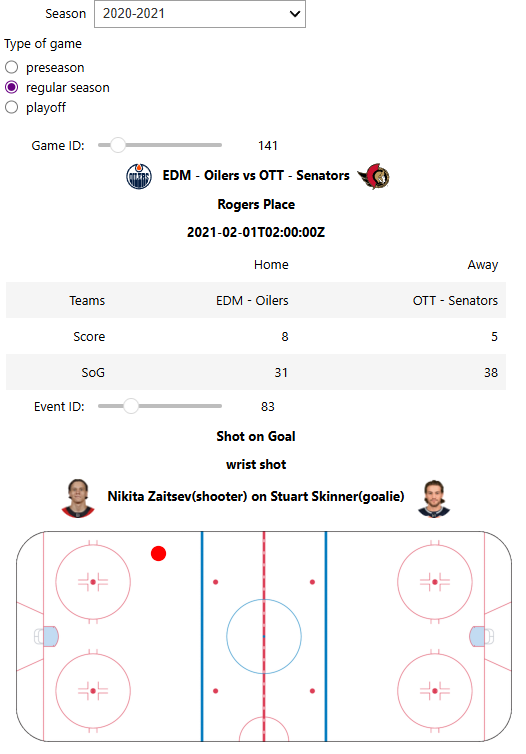
    <figcaption>
    <em>Figure 2 :</em> Outil interactif pour parcourir les évènements.
  </figcaption>
</figure>

# 3. Nettoyer les données

## Question 1

<figure style="text-align: center;">
  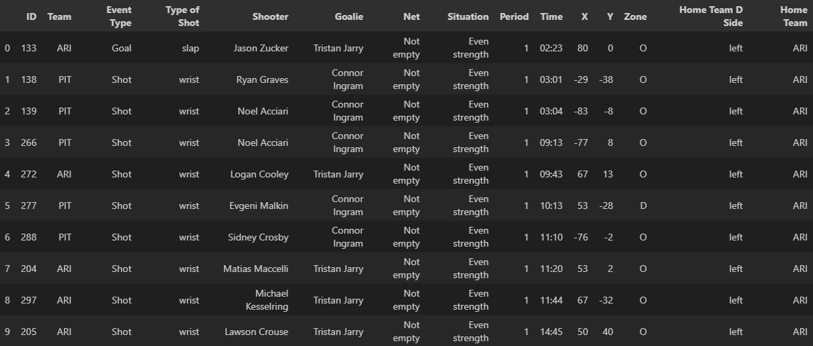
  <figcaption>
    <em>Figure 3 :</em> DataFrame des évènements de type tir et but lors d'un jeu.
  </figcaption>
</figure>

<table border="1" style="border-collapse: collapse; margin: auto; text-align: left; width: 90%;">
  <thead style="background-color: #f2f2f2;">
    <tr>
      <th>Attribut</th>
      <th>Description</th>
    </tr>
  </thead>
  <tbody>
    <tr>
      <td><b>ID</b></td>
      <td>Identifiant unique de l’évènement dans le match.</td>
    </tr>
    <tr>
      <td><b>Team</b></td>
      <td>Équipe responsable de l’action.</td>
    </tr>
    <tr>
      <td><b>Event Type</b></td>
      <td>Type d’évènement (tir, but).</td>
    </tr>
    <tr>
      <td><b>Type of Shot</b></td>
      <td>Type de tir.</td>
    </tr>
    <tr>
      <td><b>Shooter</b></td>
      <td>Joueur qui a effectué le tir.</td>
    </tr>
    <tr>
      <td><b>Goalie</b></td>
      <td>Gardien de but.</td>
    </tr>
    <tr>
      <td><b>Net</b></td>
      <td>Indique si le filet adverse était vide.</td>
    </tr>
    <tr>
      <td><b>Situation</b></td>
      <td>Situation de jeu (5v5, avantage numérique, infériorité).</td>
    </tr>
        <tr>
      <td><b>Period</b></td>
      <td>Numéro de la période.</td>
    </tr>
    <tr>
      <td><b>Time</b></td>
      <td>Temps écoulé dans la période au format.</td>
    </tr>
    <tr>
      <td><b>X</b></td>
      <td>Coordonnée X de l’évènement sur la patinoire.</td>
    </tr>
    <tr>
      <td><b>Y</b></td>
      <td>Coordonnée Y de l’évènement sur la patinoire.</td>
    </tr>
    <tr>
      <td><b>Zone</b></td>
      <td>Zone dans laquelle l'évènement s'est passé.</td>
    </tr>
    <tr>
      <td><b>Home Team D Side</b></td>
      <td>Côté defensif de l'équipe à domicile.</td>
    </tr>
    <tr>
      <td><b>Home Team</b></td>
      <td>L'équipe à domicile.</td>
    </tr>
  </tbody>
</table>

## Question 2

Si le champ force n'était pas disponible pour le tir, à chaque fois qu'un tir a lieu on pourrait regarder tous les évènements de type penalité survenus dans les 5 dernières minutes de la partie. On choisit ici 5 minutes, car une pénalité majeure dure justement 5 minutes. Par contre, si un évènement de type but survient dans les 5 dernière minutes, il faut vérifier quelle équipe a fait le but. Si l'équipe qui a marqué le but était en avantage numérique, alors une pénalité mineure infligée à l'équipe adverse prend fin, donc, pour l'équipe adverse, il faut consider les évènemnts de pénalité qui survient seulement après ce but pour déterminer la force lors d'un tir au but. Les pénalités majeures continuent toujours jusqu'à la fin de leur durée. Si plusieurs pénalité mineures sont actives, seule la première est terminée immédiatement après un but.

Ensuite, pour chaque évènement de penalité, on peut regarder le temps dans la période (diponible dans les données) et le comparer au temps de l'évènement du tire au but 

1. Si c'est une pénalité mineur et que la difference de temps est inférieur à 2 minutes, alors cette pénalité était encore active lors du tire.

2. Si c'est un pénalité majeure et que la différence de temps est inférieur à 5 minutes, alors cette pénalité était également active.

Le type est de pénalité est diponible dasn les détail de l'évènement de penalité sous la variable *typeCode*. Par contre, une pénalité  en fin de période peut rester active au début de la prochaine période. Ainsi, si un tir est effectué en début de période, il faut aussi prendre en compte les évènements de la dernière période (si un tir est à 3 minutes du début de la période, il faut vérifier s'il y a eu une pénalité dans les 2 dernières minutes de la derniere précédente (c-à-d à partir de 18 minutes).)

Ensuite, on identifie l'équipe qui est pénalisée. 

1. Si chaque équipe a le même nombres de pénalités actives lors du tir au but, alors les forces sont égales.
2. Si l'équipe qui n'a pas effectué le tir a le plus de pénalités actives, alors l'équipe qui tir est en avantage numérique.
3. Si l'équipe qui a effectué le tir a le plus de pénalités actives, alors cette équipe est en désavantage numérique.

Pour connaître la force réelle, on part de la situation par default de 5c5. Ensuite pour chaque pénalité active, on soustrait un joueur de l'équipe qui recoit une pénalité. Si un but est effectuer et que l'équipe étai déjà est avantage numérique à cause d'une pénalité mineur, alors on ajoute un joueur a l'équipe adverse puisque la pénalité prend fin.

Enfin, pour ce qui est de la situation du filet (vide ou avec gardien), on peut l'ignorer: si un tir est effectué et qu'il n'y avait pas de gardien, cela aurait nécessairement été un but et non un tir, puisque pour ce milestone on ne considère pas les tirs manqués ou bloqués dasn le DataFrame.

## Question 3

Une caractéristique intéressante pourrait être d'indiquer si un tir ou un but est considéré comme un rebond. Cela pourrait être représenté par une valeure binaire dans le DataFrame. Pour déterminer si un tir ou un but est un rebond, on peut regarder les évènements survenus quelques secondes avant, si un autre tir de la même équipe est présent, alors le tir actuel peut être classé comme un rebond. Les rebonds sont souvent associés à de meilleurs chances de marquer.


On pourrait également ajouter une variable indiquant si un tir est dangereux ou non. Cette information peut être déterminé à partir des coordonnées de l'évènement. Une zone serait déterminer comme haut danger sur la patinoir, par exemple en avant du filet. Les tir provenant de cette zone sont plus susceptibles de devenir des buts. Avec cette information on peut déterminer quelle équipe a généré les meilleurs chances de marquer durant la partie.


Il pourrait être pertinent d'ajouter le temps total de pénalité d'une équipe. Celui-ci peut être calculé en additionnant la durée de toutes les pénalité reçues par équipe au cors d'une partie. Cela pourrait nous aider à évaluer l'aggressivité ou l'indiscipline d'une équipe et d'analyser, par exemple, si le jeu physique influence les chances de gagner des partie.

Enfin, on pourrait ajouter est le taux de mises en jeu gagnées par équipe. Celui-ce peut être calculé en divisant le nombre de mises en jeu gagnées par équipe par le nombre total de mises en jeu dans la partie. Cette caractéristique permet d'évaluer la capacité d'une équipe à contrôler la possession de la rondelle après un arrêt de jeu. Cela peut également jouer sur la probabilité de générer un but ou de remporter des victoires si une équipe gagne beaucoup de mises au jeu dans la zone offensive.

# 4. Visualisations simples

## Question 1: Comparaison des types de tirs de toutes les équipes (2023-2024)

<figure style="text-align: center;">
  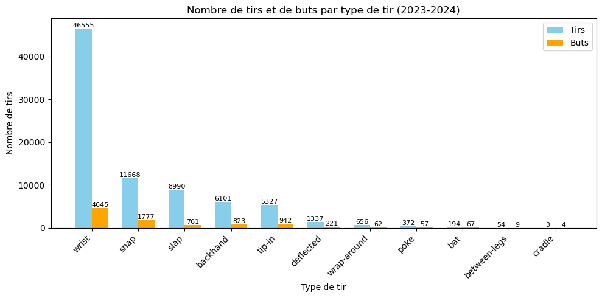
  <figcaption>
    <em>Figure 4 :</em> Graphique superposant, pour chaque type de tir, le nombre total de tirs et de buts réalisés durant la saison 2023-2024.
  </figcaption>
</figure>

### Type de tir le plus courant

Grâce à ce graphique on peut voit clairement que le type de tir le plus courat est "wrist" avec une grande avantage. 

### Type de tir le plus dangereux

Si on considère seulement le graphique ci-dessus, on pourrait dire que le type de tir le plus dangereux serait aussi "wrist" car est celui qui a provoqué le plus grand nombre de buts marqués dans la saison. Cependant, cela pourraît être dû au fait qu'il est aussi le type de tir le plus réalisé. En effet, on peut remarquer sur le graphique que les types de tirs les plus courants sont aussi ceux qui provoquent le plus grand nombre de buts. 

Si on considère que le tir le plus dangereux est celui avec lequel le plus grand nombre de buts ont été marqués, alors la réponse précédente serait correcte. Par contre, si on considère que le type de tir le plus dangereux est celui avec le plus d'éfficacité, c'est à dire celui avec la plus grande proportion de buts marqués par rapport au total de tirs effectués pour ce type, on peut utiliser le graphique suivant pour le trouver.

<figure style="text-align: center;">
  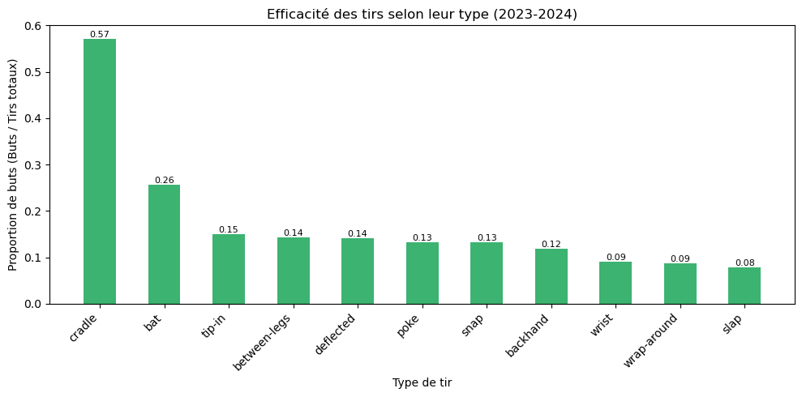
  <figcaption>
    <em>Figure 5 :</em> Graphique montrant l'éfficacité de chaque type de tir pour la saison 2023-2024.
  </figcaption>
</figure>

Avec ce graphique on trouve que le type de tir le plus dangereux par éfficacité pour cette saison est "cradle". Cependant, cette efficacité pourrait être dû justement au fait qu'il est le tir moins fréquent de toute la ligue.

Si on essaye donc de trouver le type de tir le plus dangereux en appliquant aux même temps les deux interprétations de ce qui veur dire *dangereux*, on peut conclure que le type de tir le plus dangereux est "snap", puisqu'il regroupe un grand nombre des buts totaux pour la saison et son éfficacité est aussi très acceptable (13%) comparé aux atres types de tir.

### Choix du type de graphique

On a choisi de représenter ces données avec un histogramme car ce type de graphique permet de comparer facilement les valeurs discrètes, dance cas les types de tir, entre elles. En superposant le nombre de buts et de tirs, on visualise à la fois la fréquence d’utilisation et on visualise une tendance d'éfficacité qui est après renforcée par le deuxième histogramme. Cela rend l’analyse intuitive et claire. Les barres des histogrammes permettent facilement de mettre en évidence les différences de volume et permettemt d’identifier rapidement les types les plus courants et les plus éfficaces, ce qui est le but de cette question.

## a. Relation entre la distance à laquelle un tir a été effectué et la chance qu'il s'agisse d'un but

Les graphiques suivants montrent les relations entre la distance à laquelle un tir a été effectué et la chance qu'il s'agisse d'un but pour les saisons entre 2018-2019 et 2020-2021. 

On a réalisé deux graphiques différents pour répondre à cette question, le premier montre la relation des tirs et des buts en fonction de la distance, et le deuxième montre la probabilité (chance) qu'un tir soit un but en fonction de la distance. On expliquera plus en détail pourquoi on a choisi d'utiliser ces deux graphiques dans les paragraphes suivants.

### Saison 2018-2019 

<sup>**<u>IMPORTANT</u>:** Pour cette saison, les données concernant le côté défensif de l’équipe locale n’ont pas été enregistrées dans l'API de la NHL. Cette information est pourtant nécessaire pour déterminer de quelle partie de la zone neutre (neutre-offensive ou neutre-défensive) un tir a été effectué. En conséquence, nous avons décidé d’assumer que, pour cette saison uniquement, tous les tirs provenant de la zone neutre ont été réalisés depuis la zone neutre-offensive. Ainsi, la distance au filet le plus proche (la plus petite distance) sera utilisée pour représenter la distance du tir.</sup>

<sup>Cette décision se justifie par le fait qu’il est beaucoup plus probable qu’un tir effectué depuis la zone neutre provienne de la zone neutre-offensive plutôt que de la zone neutre-défensive (comme l’indiquent les graphiques des autres saisons). Vous observerez donc, sur les graphiques de cette saison, une ligne droite nulle entre les distances de 98 et 115, mais cela n’affecte pas la tendance générale ni l’interprétation des résultats.</sup>

<figure style="text-align: center;">
  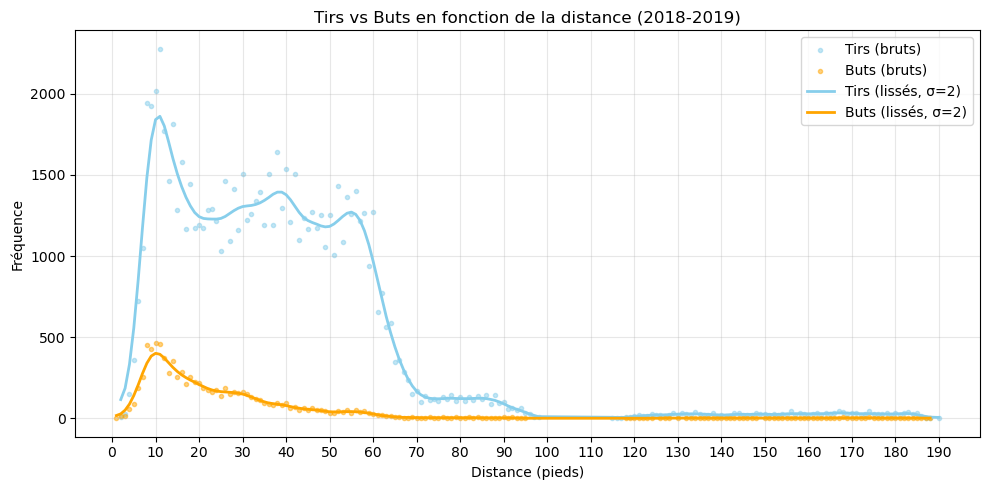
  <figcaption>
    <em>Figure 6 :</em> Graphique montrant le nombre de tirs et buts en fonction de la distance pour la saison 2018-2019.
  </figcaption>
</figure>

<figure style="text-align: center;">
  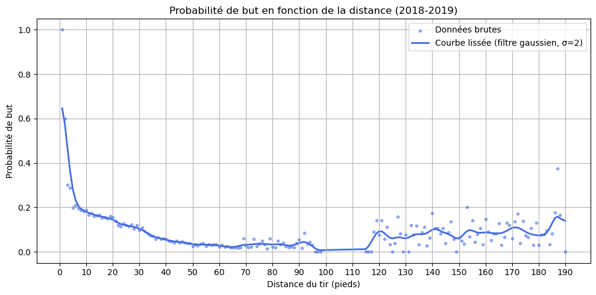
  <figcaption>
    <em>Figure 7 :</em> Graphique montrant probabilité qu'un tir soit un but en fonction de la distance pour la saison 2018-2019.
  </figcaption>
</figure>

### Saison 2019-2020

<figure style="text-align: center;">
  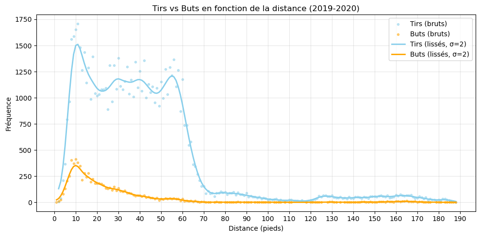
  <figcaption>
    <em>Figure 8 :</em> Graphique montrant le nombre de tirs et buts en fonction de la distance pour la saison 2019-2020.
  </figcaption>
</figure>

<figure style="text-align: center;">
  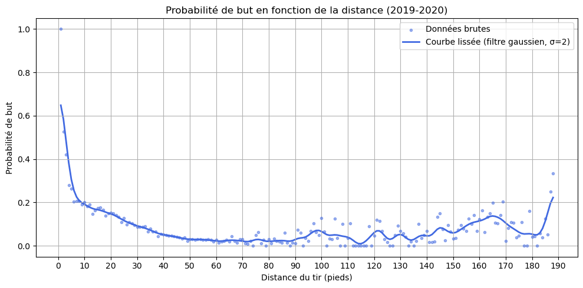
  <figcaption>
    <em>Figure 9 :</em> Graphique montrant probabilité qu'un tir soit un but en fonction de la distance pour la saison 2019-2020.
  </figcaption>
</figure>

### Saison 2020-2021

<figure style="text-align: center;">
  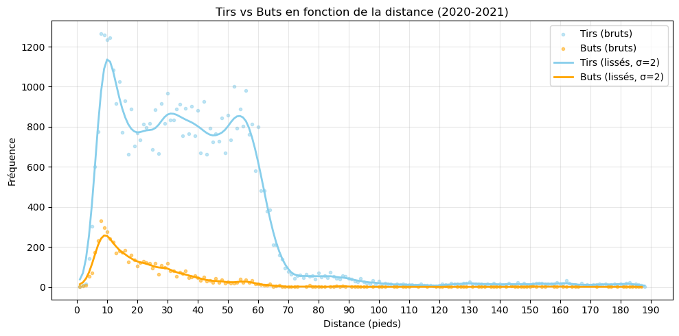
  <figcaption>
    <em>Figure 10 :</em> Graphique montrant le nombre de tirs et buts en fonction de la distance pour la saison 2020-2021.
  </figcaption>
</figure>

<figure style="text-align: center;">
  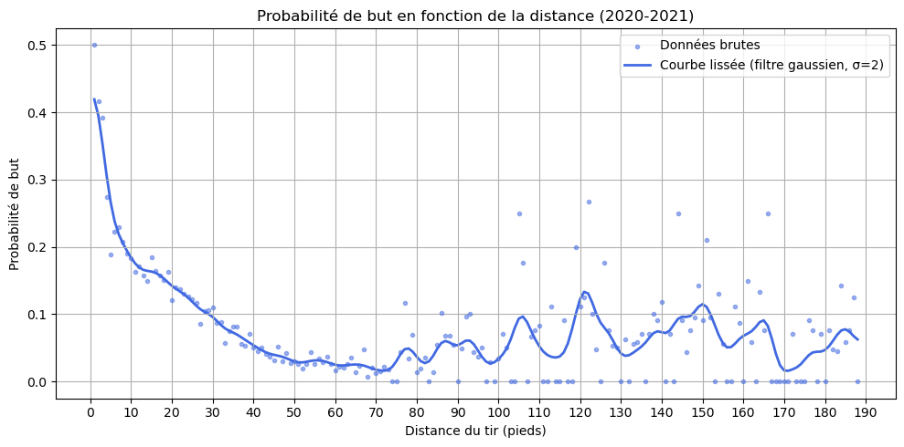
  <figcaption>
    <em>Figure 11 :</em> Graphique montrant probabilité qu'un tir soit un but en fonction de la distance pour la saison 2020-2021.
  </figcaption>
</figure>

On peut voir que les deux graphiques sont similaires entre chaque saison, avec cela on peut répondre à notre question initiale d'une façon générale. Grâce aux graphiques de la fréquence de tirs et de buts en fonction de la distance (premier graphique pour chaque saison), on peut remarquer que le plus grand nombre de buts ont été marqués à une distance d'environ 10 pieds. En remarque de même que plus on s'éloigne ou on se rapproche de cette distance, le nombre de buts, de même que le nombre de tirs, diminue. En effet, les tirs de très proche ou de très loins sont pas très courants en hockey. Cela nous ferait penser que la distance à laquelle il y a plus de chance de marquer est autour des 10 pieds. Cependant, on remarque aussi que c'est à cette distance où il y a le plus grand nombre de tirs. C'est pour cette raison qu'on a besoin du deuxième graphique pour confirmer que cette grande quantité de buts n'est pas juste parce que c'est la distance à laquelle le plus grand nombre de tirs on été effectués.

Les deuxièmes graphiques, qui montrent la probabilité qu'un tir soit but en fonction de la distance (proportion de buts par rapport au nombre total de tirs pour chaque distance) nous donnent une réponse beaucoup plus claire à notre question. De même que pour le premier graphique, on remarque que la tendance de ce deuxième graphique se maintient au cours des différentes saisons. Cela nous permet alors de donner une réponse plus générale du sport. Ces graphiques nous montrent clairement une relation inverse (corrélation négative) entre la distance à laquelle un tir a été effectué et la chance qu'il s'agisse d'un but. Cela signifie que plus la distance augmente, moins probable est que ce tir termine en but. Au contraire, les distances où plus de chances il y a de marquer sont les distances courtes, en général entre 1 et 30 pieds. 

Donc, si on combine nos observations des deux graphiques, on pour affirmer que la relation entre la distance à laquelle un tir est effectué et la chace qu'il s'agisse d'un but est une relation inverse ou corrélation négative. Donc, plus la distance du tir est grande, moins de chances il y a de marquer. En combinant les deux graphiques ont peut conclure que les distances de moins de 30 pieds sont celles où créent le plus de danger est c'est plus probable qu'ils finissent en but.

Dans les deuxièmes graphiques on peut aussi remarquer des petites hausses dans la probabilité qu'un tir soit but pour les distances les plus éloignées (plus de 100 pieds), cependant cela peut s'expliquer à cause du très petit nombre de tirs qui sont effectués à cette distance. En effet, lorsqu'un joueur tire depuis un très grande distance, c'est d'habitude parce qu'ils sont presque certains de marquer. Alors, la proportion de buts pour ces distances par rapport au nombre total de tirs est normal qui soit élévée, cependant cela ne remet pas en cause la tendance générale. Globalement, plus la distance augmente, moins la probabilité de marquer est élevée.

### Choix du type de graphique

On a choisi ce type de graphiques car ils permettent de visualiser à la fois la distribution réelle des données (à travers les points) et la tendance générale (grâce à la courbe lissée). Cela rend l’analyse plus complète: les points montrent la variabilité et la densité des tirs selon la distance, tandis que la courbe facilite l’interprétation globale de la relation entre la distance du tir et la probabilité de marquer.

## Question 2: Pourcentage de buts en fonction de la distance au filet et du type de tir

<figure style="text-align: center;">
  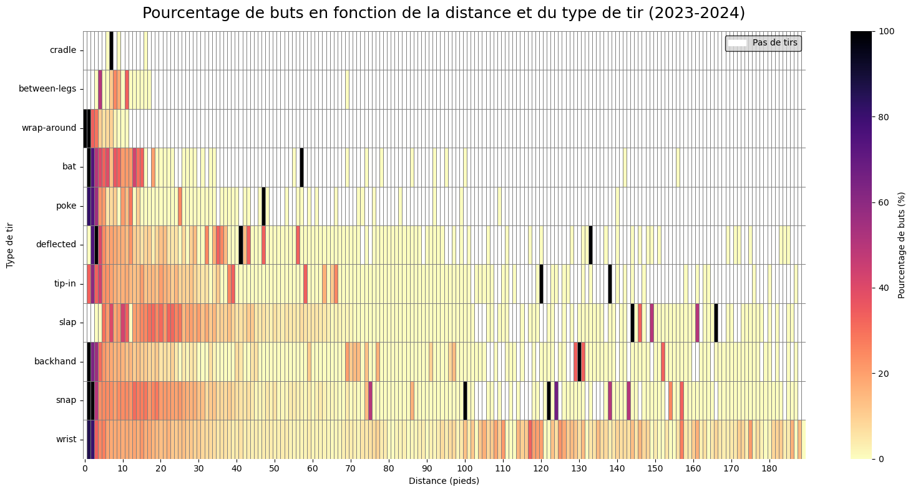
  <figcaption>
    <em>Figure 12 :</em> Graphique montrant le pourcentage de buts en fonction de la distance et du type de tir pour la saison 2023-2024.
  </figcaption>
</figure>

### Influence de la distance selon le type de tir

Premièrement, ce graphique nous permet de voir clairement que chaque type de tir est plus utilisé ou moins utilisé selon la distance à laquelle un tir est effectué. Les cases de couleur blanche, représentent les distances pour lesquelles il n'y a pas eu de tirs pour chaque type de tir. On remarque alors que l'utilisation de certains types de tirs dépend fortement de la distance à laquelle un tir est effectué. 

Effectivement, on remarque que, même si l'éfficacité (% de buts) pour les types de tir "wrist", "snap", "slap" et "backhand" peut être basse pour certaines distances, ils sont des types de tir utilisés à toutes (ou presque toutes) les distances. 

Par contre, des types de tir comme "cradle", "between-legs" et "wrap-around" sont des types de tirs utilisés uniquement à des distances courtes. À partir des distances plus grandes que 10-15 pieds, il n'y a pas eu de tirs pour ces types. 

Finalement, pour les autres types de tir comme "tip-in", "deflected", "poke" et "bat", on remarque une corrélation négative entre leur utilisation et la distance. En effet, on remarque sur le graphique que plus la distance augmente, moins ses types de tirs sont utilisés (il y a de plus en plus de cases blanches au fur et à mesure que la distance augmente).

### Types de tirs les plus dangereux

Grâce à ce graphique on peut voir que depuis une distance courte, la plupart des types de tir (sauf peut-être "cradle" et "between-legs" qui sont très peu utilisés) sont assez éfficaces (dangereux). En effet, les pourcentages de buts sur les distances entre 1 et 10 pieds sont assez élévés. Cela correspond bien à notre analyse des questions précédentes. 

Cependant, plus on s'éloigne, plus l'éfficacité (% de buts) commence à varier selon le type de tir. Entre les 10 et 40 pieds, on peut voir qu'en général les types de tir "snap" et "slap" sont plus dangereux que le reste. En effet, on remarque que leur pourcentage de buts pour ces distances sont un peu plus élévés. Donc, ils peuvent être considérés comme les types de tirs les plus dangereux pour les distances moyennes-courtes.

Pour les distances moyennes un peu plus éloignées (entre 40 et 90 pieds), on remarque une forte baisse des pourcentages de buts pour la majorité des types de tirs. On pourrait penser que les types de tir "wrist", "snap" et "slap" sont les plus dangereux pour ces distances à cause de leur pourcentage de but légèrement plus élévés que celui des autres types de tir, cependant on ne peut pas affirmer cela avec confiance car ils sont aussi les types de tir les plus utilisés (avec une grande différence) pour ces distances. Vous pouvez remarquer cela grâce au graphique suivant.

<figure style="text-align: center;">
  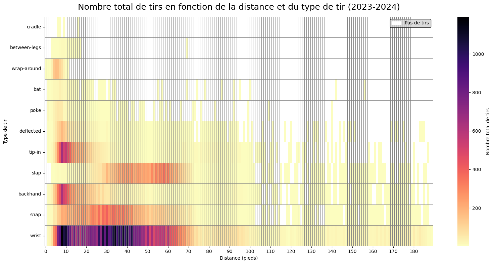
  <figcaption>
    <em>Figure 12 :</em> Graphique montrant le nombre total de tirs en fonction de la dstance et du type de tir pour la saison 2023-2024.
  </figcaption>
</figure>

De même, pour ces distances entre 40 et 90 pieds on remarque que les types de tirs "backhand" et "tip-in" ont des pourcentages de buts élévés pour certaines distances très précises. Cependant, à cause de l'isolement de ses pourcentages et des faibles pourcentages pour les distances autour, on peut dire que cela n'est qu'à cause de situations très exceptionnelles probablement uniques à cette saison 2023-2024. Donc, en général on peut dire que les tirs à ces distances sont peux dangereux et aucun type de tir ne peut être considéré vraiment comme plus dangereux que les autres.

Finalement, pour les distances élévées (entre 90 et 190 pieds) on peut remarquer que le type de tir "wrist" est le plus dangereux à cause de sa tendance à maintenir un pourcentage de but autour 20% et 30% au cours de ses distances, ce qui est beaucoup plus élévé que le pourcentage de but des autres types de tir. Effectivement, pour certaines distances très précises il y a certains types de tirs qui ont un pourcentage de but plus élévé que "wrist", cependant sont des cas très isolés pour des distances très précises et, comme pour les cas précédents, peuvent êtres dûs à des cas très exceptionnels pour cette ligue. Donc, dans aucun cas cela peut nous faire penser que ses types de tir sont plus éfficaces (dangereux) que "wrist" pour les distances lointaines, puisque wrist montre un pourcentage de but plus ou moins constant au cours de ses distances qui est en général plus élévé que celui de ses types de tirs avec des cas spéciaux.


# 5. Visualisations avancées

## Question 1: Exportation des graphiques

<iframe src="/assets/html/2016-2017_dynamic_heatmap.html"></iframe>
<hr>
<iframe src="/assets/html/2017-2018_dynamic_heatmap.html"></iframe>
<hr>
<iframe src="/assets/html/2018-2019_dynamic_heatmap.html"></iframe>
<hr>
<iframe src="/assets/html/2019-2020_dynamic_heatmap.html"></iframe>
<hr>
<iframe src="/assets/html/2020-2021_dynamic_heatmap.html"></iframe>

## Question 2: Interprétations à partir des graphiques

Ces graphiques nous permettent de voir la capacité offensive des différentes équipes et leur style de jeu offensif propre, qui varient nettement d’une équipe à l’autre. On remarque que certaines équipes privilégient des tirs de proche, tandis que d’autres tirent plus souvent des zones plus éloignées. De même, on peut remarquer si une équipe à des difficultés offensives ou, au contraire, est une excellente équipe offensivement. 

Par exemple, une équipe avec une forte présence de zones en rouge foncé (différence positive de taux de tirs) montre que cette équipe a une activité offensive supérieure à la moyenne de la ligue. Cela traduit une plus grande capacité à générer des occasions dangereuses et, par conséquent, une probabilité plus grande de marquer et éventuellement de gagner des matchs (on reparlera de cela plus bas). C’est le cas, par exemple, des Toronto Maple Leafs ou des Pittsburgh Penguins lors de la saison 2016-2017, qui ont une forte zone rouge proche du filet adversaire, ce qui montre une supériorité offensive fâce au reste de la ligue.

Au contraire, une équipe dont les tirs proviennent majoritairement de positions éloignées et qui présente des zones bleues près du filet montre une faiblesse en attaque. Cela indique une difficulté à s’approcher au filet des équipes adversaires et à créer des occasions de danger, qui sont généralement les tirs à distances courtes. Un exemple de cela pour la saison 2016-2017 sont les New Jersey Devils, qui montrent d’importantes zones bleues dans une large partie de la zone offensive, particulièrement près du filet, ce qui suggère une incapacité à générer des tirs dangereux et une performance offensive inférieure à la moyenne de la ligue.


## Question 3: Avalanche du Colorado

### Saison 2016-2017

En regardant le graphique de l'Avalanche du Colorado pour la saison 2016-2017 on peut remarquer qu'il y a une grande partie de la zone offensive, surtout la région centrale, qui est en couleur bleue. Spécialement on remarque que la zone proche au filet est en couleur bleue très foncée. Cela signifie que, pour cette saison, le taux de tirs par heure de cette équipe à été très en dessous de la moyenne de la ligue (-0.8 tirs par heure pour la zone la plus foncée). Avec cette information, on peut penser que l'équipe n'est pas été très performante offensivement par rapport aux autres équipes de la ligue cette saison. En effet, on pourrait dire que cette équipe a eu beaucoup de difficultés pour se raprocher au filet adversaire et créer des situations de danger. Surtout, sachant grâce aux réponses des parties précédentes que les tirs les plus dangereux sont ceux qui sont faits depuis des distances courtes (proches au filet), cette zone bleue pourrait nous donner un indice que l'équipe, n'étant pas très capable de se raprocher au filet pour tirer, a eu du mal à marquer durant cette saison. Cela peut donc provoquer que cette équipe ait eu peu de matchs gagnés et probablement un mauvais classement à la fin de la saison.

### Saison 2020-2021

En regardant leur graphique pour la saison 2020-2021 on peut remarquer une très grande différence. Leur graphique pour cette saison montre un vaste zone rouge dominante proche du filet (0 à 10 pieds) et tout au long du centre de la zone offensive (distances moyennes-proches entre 10 et 60 pieds). Cela montre une amélioration notable de la performance offensive de l'équipe, lui permettant ainsi de dépasser le taux moyen de tir par heure de la ligue dans une très grande partie de la zone offensive qui, le plus important, est celle qui crée les occasions plus dangereuses (proche du filet et zone centrale). Cela se traduit donc par une supériorité et dominance offensive fâce aux autres équipes cette saison. Cet haut volume de tirs sur ces zones peuvent donc indiquer un nombre élévé de tirs dangereux réalisé sur ses adversaire, se traduisant ainsi par plus de buts marqués, donc plus de matchs gagnés, et finalement probablement un meilleur classement sur la ligue (au moins contre celui de 2016-2017).

### Conclusion

En conclusion, on peut remarquer une amélioration très grande dans la performance offensive de l'équipe Avalanche du Colorado entre les saisons 2016-2017 et 2020-2021. On observe une équipe qui joue plus offensivement et, le plus important, qui réalise plus de tirs dangereux par rapport à la moyenne du taux de tirs par heure de la ligue pour cette saison (2020-21). Cela ne veut pas dire à 100% que l'équipe a gagné plus de matchs ou marqué plus de buts, puisque les tirs pourraient avoir été bloqués par le gardien adversaire ou l'équipe aurait pû avoir eu des difficultés défensives, mais ça montre au moins une différence très positive offensivement. 

Cependant, en regardant les classements pour les deux saisons, on peut confirmer nos suppositions faites précédemment. Pour la saison 2016-2017 (saison avec des difficultés offensives) on remarque effectivement que l'équipe à fini dernier dans le classement de sa conférence. D'un autre côté, on voit aussi qu'ils ont fini premiers dans le classement de leur conférence pour la saison 2020-2021. Cela montre qu'effectivement l'équipe a eu une meilleure performance offensive qui lui a permis d'avoir plus d'occasions avec des tirs dangereux et donc avoir des meilleurs résultats. En effet, on remarque que cette amélioration et dominance offensive à aidé à l'équipe à faire plus de buts (166 en 2016-2017 vs 197 en 2020-2021), gagner plus de matchs (22 en 2016-2017 vs 39 en 2020-2021) et donc avoir un meilleur classement (dernier en 2016-2017 vs 1er en 2020-2021). Cependant, dans la question suivante on discutera pourquoi une bonne performance offensive n'est pas la seule raison qui explique pourquoi est-ce qu'un équipe obtient un meilleur classement dans la ligue.

## Question 4: Sabres de Buffalo et Lightning de Tampa Bay

### Sabres de Buffalo (2018-19, 2019-20 et 2020-21)

En regardant les graphiques des Sabres de Buffalo pour les saisons 2018-19, 2019-20 et 2020-21, on remarque que pour ces saisons ils ont eu des problèmes à réaliser des tirs offensivement. Si bien les graphiques sont différents (quelques zones en difficulté pour une saison ne le sont pas trop pour d'autres), ils montrent tous en commun la zone proche du filet et la zone centrale de la zone offensive en bleu, ce qui veut dire que dans les 3 saisons l'équipe à eu des problèmes pour se raprocher à une distance d'environ moins de 40 pieds du filet et tirer. Comme on a vu précédemment, cette difficulté lors de la création de tirs (situations) dangereux peut être un signe d'une mauvaise performance de l'équipe au cours de ces saisons. 

### Lightning de Tampa Bay (2018-19, 2019-20 et 2020-21)

En regardant les graphiques des Lightning de Tampa Bay pour les saisons 2018-19, 2019-20 et 2020-21, on remarque que pour ces saisons ils ont eu une bonne performance dans la zone centrale de la zone offensive, mais seulement entre 10 et 60 pieds. En effet, ces zones se montrent en rouge dans les graphiques, ce qui indique que l'équipe à tiré plus de fois par heure sur cette zone que la moyenne de tous les équipes de la ligue. Leur performance offensive sur cette zone est don supérieure à la majorité des équipes de la ligue. 

Cependant, cette bonne performance n'est pas présente autour du filet. En effet,  spécialement pour 2018-19 et 2019-20 la zone de 10 pieds autour du filet se montre en bleu foncé, ce qui veut dire que l'équipe a eu beaucoup de difficultés à créer des tirs proche du filet.

### Comparaison

En comparant les graphiques des deux équipes, on peut remarquer que les Lightning de Tampa Bay ont eu beaucoup plus de facilité que les Sabres de Buffalo pour réaliser des tirs depuis la zone centrale de la zone offensive entre 10 et 60 pieds. Cependant, les deux équipes ont eu beaucoup de difficultés à tirer à moins de 10 pieds du filet. Sachant que les Sabres de Buffalo ont eu des problèmes pendant ces saisons, ces informations nous surprennent pas, mais sachant que les Lightning de Tampa Bay sont une équipe que malgré ce problème a réussit à remporter 2 coupes Stanley de suite (2019-20 et 2020-21) cela surprend un peu. Mais si deux équipes avec la même difficulté ont des résultats très différents, c'est quoi la vraie raison du succès et des problèmes de ses équipes ?

### Explication des problèmes et du succès de ses équipes

Puisque dans ce cas la seule information dont on dispose sont ces graphiques, on peut penser que la raison du succès des Lightning de Tampa Bay est justement la dominance offensive qu'ils ont dans la zone centrale entre 10 et 60 pieds du filet. En effet, les Sabres de Buffalo ont eu beaucoup de difficultés à générer des tirs sur ces zones, ce qui pourrait expliquer leur problèmes au cours de ses saisons. On peut penser cela à partir des graphiques puisque celle-ci est la seule différence vraiment importante entre les graphiques des deux équipes, mais est-ce qu'on peut être certains que celle-ci est est la vraie ou la seule raison ? Non, et on discutera pourquoi ci-dessous.

### Est-ce que ces graphiques sont suffisants pour expliquer les succès ou problèmes d’une équipe?

Ces graphiques offrent une vue très utile du profil offensif des équipes, en montrant où elles tirent le plus ou le moins et comment leur activité se compare à la moyenne de la ligue. Ils permettent donc d’identifier certaines forces (réalisation fréquente de tirs dans des zones dangereuses) ou faiblesses (tirs lointains ou faible activité offensive).

Cependant, ils ne sont pas suffisants pour comprendre complètement les succès ou les difficultés d’une équipe. Le rendement d’une équipe dans un match et au cours d'une saison dépend aussi de nombreux autres facteurs, comme:
* L’efficacité des tirs (le pourcentage de buts marqués par rapport au nombre total de tirs),
* La performance défensive (différence du taux de tirs reçus par l'équipe avec celui de la ligue),
* Conditions dans lesquelles les tirs ont été effectués (en désavantage ou en avantage numérique),
* Les stratégies de jeu,
* Performance du gardien adversaire et aussi celui de l'équipe (nombre de tirs blockés),
* etc.

En conclusion, si bien ces graphiques donnent des informations très utiles pour comprendre les tendances offensives d'un équipe, ce qui est une partie très importante pour trouver une explication au succès et aux problèmes d'une équipe, elles ne sont pas suffisantes et doivent être complétées par d’autres indicateurs (mentionnés ci-dessus) pour obtenir une analyse complète de la performance d’une équipe et comprendre complètement l’ensemble des facteurs qui expliquent leur succès ou problèmes lors d'une saison.
