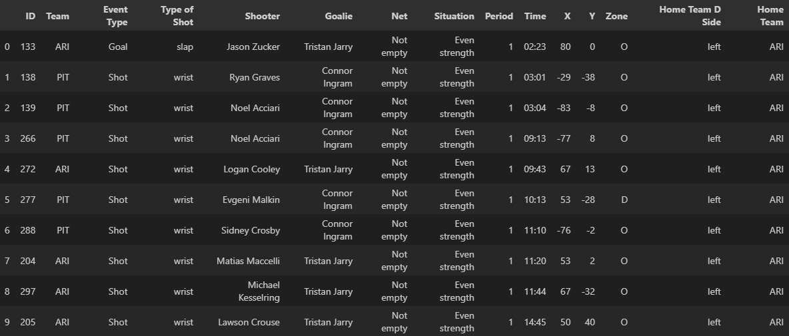

# Acquisition de données
## Question 1

Pour télécharger les données, une classe nommée Data a été créée. Pour effectuer le téléchargement, il suffit simplement d'instancier cette classe puis d'appeler la fonction *load_data_local(season: list[str], merge_one_file: bool)* en lui passant une liste de saisons en argument, ce qui permet d'indiquer les saisons à télécharger. Ensuite, il suffit d'appeler la fonction *get_data(file_path: str)* pour avoir accès aux données en lui passant le chemin du fichier de la partie. Ceci est montré dans l'exemple de code suivant.

```python
    d = Data()
    d.load_data_local(['2016-2017', '2017-2018', '2018-2019', 
                       '2019-2020', '2020-2021', '2021-2022', 
                       '2022-2023', '2023-2024'], merge_one_file=True)
    data = d.get_data(os.path.join(d.data_path, '2017-2018', '2017020005.json'))
```

Plus en détail, le téléchargement se déroule en trois grandes étapes :

1. **Récupération de la liste des matchs** <br>
    Cette étape consiste à aller chercher l'ensemble des parties disponibles via l'API NHL-reference et les sauvegarder dans un fichier JSON nommé *all_games.json*. Si ce fichier existe déjà, il n'est pas nécessaire de le retélécharger, il est directement chargé depuis le disque local.

2. **Téléchargement des matchs d’une saison**<br>
    Une fois toutes les parties chargées, pour chaque saison passée en argument à la fonction, une vérification est effectuée pour déterminer quelles parties sont manquantes dans le sous-dossier correspondant à la saison. Une fois cette vérification terminée, le téléchargement des parties manquantes est effectué.

3. **Sauvegarde et Organisation**<br>
    Finalement, tous les fichiers sont organsés dans un dossier par saison. Ainsi, chaque partie de chaque saison est représentée par un fichier JSON nommé *{ID de la partie}.json*. Il est également possible d'activer l'option *merge_one_file=True* dans les arguments de la fonction *load_data_local*, ce qui permet de fusionner l'ensemble des parties dans un fichier JSON nommé *play_by_play.json*. La capture d'écran suivante montre une petite partie de la structure des fichiers.

<figure style="text-align: center;">
  
  <figcaption>
    <em>Figure 1 :</em> Structure des fichiers de données.
  </figcaption>
</figure>

# Outil de débogage interactif
## Question 1

L'outil interactif nous permet de parcourir l'ensemble des données et de visualiser les évènements survenus lors des parties. On peut sélectionner la saison, le type de partie, la partie désirée ainsi que l'évènement. <br>

Certaines informations générales sont affichées, comme les équipes qui s'affrontent, le lieu, la date, l'heure, le résultat final et  nombre de tirs cadrés effectués par chaque équipe. <br>

Il y a également des informations suplémentaires par rapport aux évènements, notamment le type d'évènement, et le ou les joueurs impliqués. Selon le type d'évènement, il peut y avoir différents détails affichés: par exemple, dans l'exemple ci-dissous, l'évènement est un tir, donc le type de tire est affiché. <br>

Enfin, au bas de l'outil se trouvent les coordonnées sur la patinoire de l'endroit où l'évènement s'est produit (représenté par un point rouge sur la patinoire). Si aucune coordonnée est associées à l'évènement, seule la description est affichée.
<figure style="text-align: center;">
  
    <figcaption>
    <em>Figure 2 :</em> Outil interactif pour parcourir les évènements.
  </figcaption>
</figure>

# Nettoyer les données

## Question 1

<figure style="text-align: center;">
  
  <figcaption>
    <em>Figure 3 :</em> DataFrame des évènements de type tir et but lors d'un jeu.
  </figcaption>
</figure>

<table border="1" style="border-collapse: collapse; margin: auto; text-align: left; width: 90%;">
  <thead style="background-color: #f2f2f2;">
    <tr>
      <th>Attribut</th>
      <th>Description</th>
    </tr>
  </thead>
  <tbody>
    <tr>
      <td><b>ID</b></td>
      <td>Identifiant unique de l’évènement dans le match.</td>
    </tr>
    <tr>
      <td><b>Team</b></td>
      <td>Équipe responsable de l’action.</td>
    </tr>
    <tr>
      <td><b>Event Type</b></td>
      <td>Type d’évènement (tir, but).</td>
    </tr>
    <tr>
      <td><b>Type of Shot</b></td>
      <td>Type de tir.</td>
    </tr>
    <tr>
      <td><b>Shooter</b></td>
      <td>Joueur qui a effectué le tir.</td>
    </tr>
    <tr>
      <td><b>Goalie</b></td>
      <td>Gardien de but.</td>
    </tr>
    <tr>
      <td><b>Net</b></td>
      <td>Indique si le filet adverse était vide.</td>
    </tr>
    <tr>
      <td><b>Situation</b></td>
      <td>Situation de jeu (5v5, avantage numérique, infériorité).</td>
    </tr>
        <tr>
      <td><b>Period</b></td>
      <td>Numéro de la période.</td>
    </tr>
    <tr>
      <td><b>Time</b></td>
      <td>Temps écoulé dans la période au format.</td>
    </tr>
    <tr>
      <td><b>X</b></td>
      <td>Coordonnée X de l’évènement sur la patinoire.</td>
    </tr>
    <tr>
      <td><b>Y</b></td>
      <td>Coordonnée Y de l’évènement sur la patinoire.</td>
    </tr>
    <tr>
      <td><b>Zone</b></td>
      <td>Zone dans laquelle l'évènement s'est passé.</td>
    </tr>
    <tr>
      <td><b>Home Team D Side</b></td>
      <td>Côté defensif de l'équipe à domicile.</td>
    </tr>
    <tr>
      <td><b>Home Team</b></td>
      <td>L'équipe à domicile.</td>
    </tr>
  </tbody>
</table>

## Question 2

Si le champ force n'était pas disponible pour le tir, à chaque fois qu'un tir a lieu on pourrait regarder tous les évènements de type penalité survenus dans les 5 dernières minutes de la partie. On choisit ici 5 minutes, car une pénalité majeure dure justement 5 minutes. Par contre, si un évènement de type but survient dans les 5 dernière minutes, il faut vérifier quelle équipe a fait le but. Si l'équipe qui a marqué le but était en avantage numérique, alors une pénalité mineure infligée à l'équipe adverse prend fin, donc, pour l'équipe adverse, il faut consider les évènemnts de pénalité qui survient seulement après ce but pour déterminer la force lors d'un tir au but. Les pénalités majeures continuent toujours jusqu'à la fin de leur durée. Si plusieurs pénalité mineures sont actives, seule la première est terminée immédiatement après un but.

Ensuite, pour chaque évènement de penalité, on peut regarder le temps dans la période (diponible dans les données) et le comparer au temps de l'évènement du tire au but 

1. Si c'est une pénalité mineur et que la difference de temps est ind.rieur à 2 minutes, alors cette pénalité était encore active lors du tire.

2. Si c'est un pénalité majeure et que la différence de temps est inférieur à 5 minutes, alors cette pénalité était également active.

Le type est de pénalité est diponible dasn les détail de l'évènement de penalité sous la variable *typeCode*. Par contre, une pénalité  en fin de période peut rester active au début de la prochaine période. Ainsi, si un tir est effectué en début de période, il faut aussi prendre en compte les évènements de la dernière période (si un tir est à 3 minutes du début de la période, il faut vérifier s'il y a eu une pénalité dans les 2 dernières minutes de la derniere précédente (c-à-d à partir de 18 minutes).)

Ensuite, on identifie l'équipe qui est pénalisée. 

1. Si chaque équipe a le même nombres de pénalités actives lors du tir au but, alors les forces sont égales.
2. Si l'équipe qui n'a pas effectué le tir a le plus de pénalités actives, alors l'équipe qui tir est en avantage numérique.
3. Si l'équipe qui a effectué le tir a le plus de pénalités actives, alors cette équipe est en désavantage numérique.

Pour connaître la force réelle, on part de la situation par default de 5c5. Ensuite pour chaque pénalité active, on soustrait un joueur de l'équipe qui recoit une pénalité. Si un but est effectuer et que l'équipe étai déjà est avantage numérique à cause d'une pénalité mineur, alors on ajoute un joueur a l'équipe adverse puisque la pénalité prend fin.

Enfin, pour ce qui est de la situation du filet (vide ou avec gardien), on peut l'ignorer: si un tir est effectué et qu'il n'y avait pas de gardien, cela aurait nécessairement été un but et non un tir, puisque pour ce milestone on ne considère pas les tirs manqués ou bloqués dasn le DataFrame.

## Question 3

Une caractéristique intéressante pourrait être d'indiquer si un tir ou un but est considéré comme un rebond. Cela pourrait être représenté par une valeure binaire dans le DataFrame. Pour déterminer si un tir ou un but est un rebond, on peut regarder les évènements survenus quelques secondes avant, si un autre tir de la même équipe est présent, alors le tir actuel peut être classé comme un rebond. Les rebonds sont souvent associés à de meilleurs chances de marquer.


On pourrait également ajouter une variable indiquant si un tir est dangereux ou non. Cette information peut être déterminé à partir des coordonnées de l'évènement. Une zone serait déterminer comme haut danger sur la patinoir, par exemple en avant du filet. Les tir provenant de cette zone sont plus susceptibles de devenir des buts. Avec cette information on peut déterminer quelle équipe a généré les meilleurs chances de marquer durant la partie.


Il pourrait être pertinent d'ajouter le temps total de pénalité d'une équipe. Celui-ci peut être calculé en additionnant la durée de toutes les pénalité reçues par équipe au cors d'une partie. Cela pourrait nous aider à évaluer l'aggressivité ou l'indiscipline d'une équipe et d'analyser, par exemple, si le jeu physique influence les chances de gagner des partie.

Enfin, on pourrait ajouter est le taux de mises en jeu gagnées par équipe. Celui-ce peut être calculé en divisant le nombre de mises en jeu gagnées par équipe par le nombre total de mises en jeu dans la partie. Cette caractéristique permet d'évaluer la capacité d'une équipe à contrôler la possession de la rondelle après un arrêt de jeu. Cela peut également jouer sur la probabilité de générer un but ou de remporter des victoires si une équipe gagne beaucoup de mises au jeu dans la zone offensive.

# Visualisations simples

## Question 1

### a.

...content...

### b.

...content...

### c.

...content...

## Question 2

...content...

# Visualisations avancées

## Question 1

### a.

...content...

### b.

...content...

## Question 2

### a.

...content...

### b.

...content...

## Question 3

...content...

## Question 4

...content...

## Question 5

...content...

## Question 6

...content...